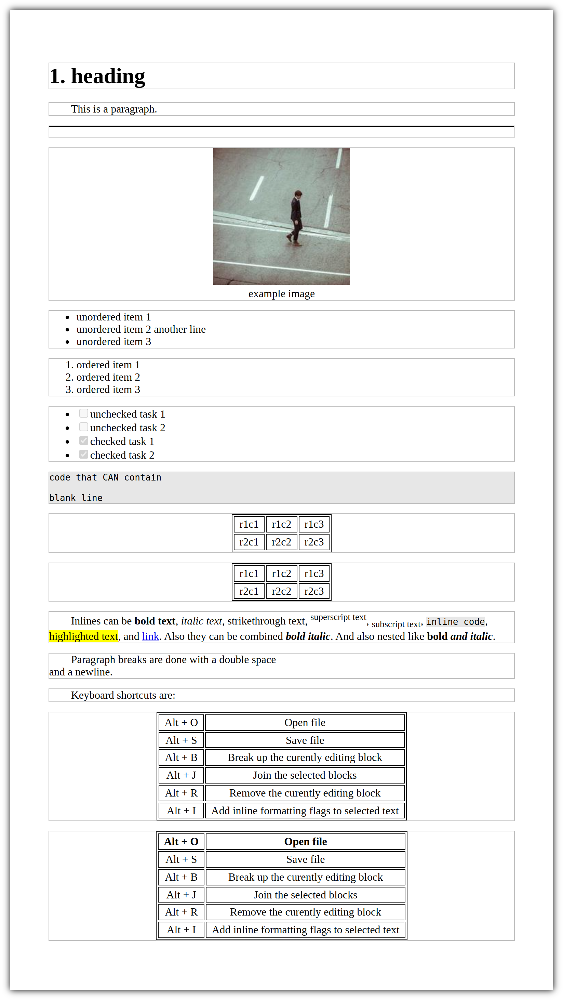

# HZTDE

Html Zu Text Document Editor. An editor that uses a similar syntax to markdown that can be used to write documents that are ready to print from the web browser.

Files are saved as *.ztx* files which are plain-text friendly.

## Usage

Download the HZTDE file and open it with Chrome or any Chromium based browser like Edge or Brave. Firefox is not compatible because it does not support the `contenteditable="plaintext-only"`😔.

The document is organized into sections which each contain a seperate block level element(heading, paragraph, image, lists, code blocks, tables, ...), which in them can contain inlne elements(bold, italic, superscript, subscript, inline text, and highlighted text).

An example for all block and inline elemets can be seen in the default document that is automatically loaded by opening `HZTDE.html`.

Upon loading a file everything is put into 1 section which can automatically be broken up using the keyboard shortcut `Alt + b`. To open an already existing *.ztx* file use `Alt + o`. To save it use `Alt + s`. *Note: if you use `Ctrs + s` the document will be saved as html which we don't want.* To join 2 or more sections use `Alt + j`, *make sure you select them while none of them are being edited*. Empty blocks still remain and apear in the browser prewiew, but aren't shown when printing. To remove any section use `Alt + r`.

Embedding raw HTML is also possible as long as it doesn't contain any blank lines because `Ctrl + b` will cause them to be seperated, causing errors.

### Example

The folowing example code, which is loaded by default upon opening `HZTDE.html`

```
# heading

This is a paragraph.

---

>image[asd|example image|https://picsum.photos/id/22/200]

- unordered item 1
- unordered item 2
another line
- unordered item 3

. ordered item 1
. ordered item 2
. ordered item 3

[ ] unchecked task 1
[ ] unchecked task 2
[x] checked task 1
[x] checked task 2

code>>>
code that CAN contain

blank line
<<<

table>>>,
r1c1 , r1c2 , r1c3
r2c1,r2c2,r2c3
<<<

table>>>|
r1c1 | r1c2 | r1c3
r2c1|r2c2|r2c3
<<<

Inlines can be !b[bold text], !i[italic text], !s[strikethrough text], !u[superscript text], !d[subscript text], !c[inline code], !h[highlighted text], and !l[link|http://google.com]. Also they can be combined !bi[bold italic]. And also nested like !b[bold !i[and italic]].

Paragraph breaks are done with a double space  
and a newline.

Keyboard shortcuts are:

table>>>|
Alt + O | Open file
Alt + S | Save file
Alt + B | Break up the curently editing block
Alt + J | Join the selected blocks
Alt + R | Remove the curently editing block
Alt + I | Add inline formatting flags to selected text
<<<

htable>>>|
Alt + O | Open file
Alt + S | Save file
Alt + B | Break up the curently editing block
Alt + J | Join the selected blocks
Alt + R | Remove the curently editing block
Alt + I | Add inline formatting flags to selected text
<<<
```

after breakng up the sections(`Alt + b`), will generate the folowing document


